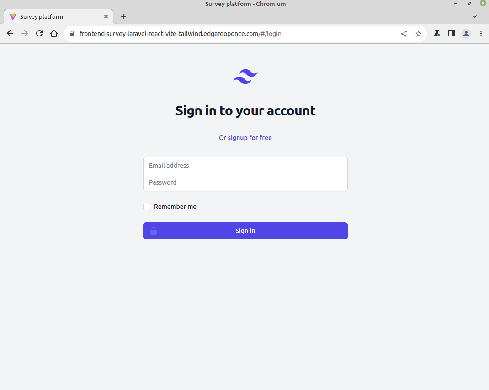
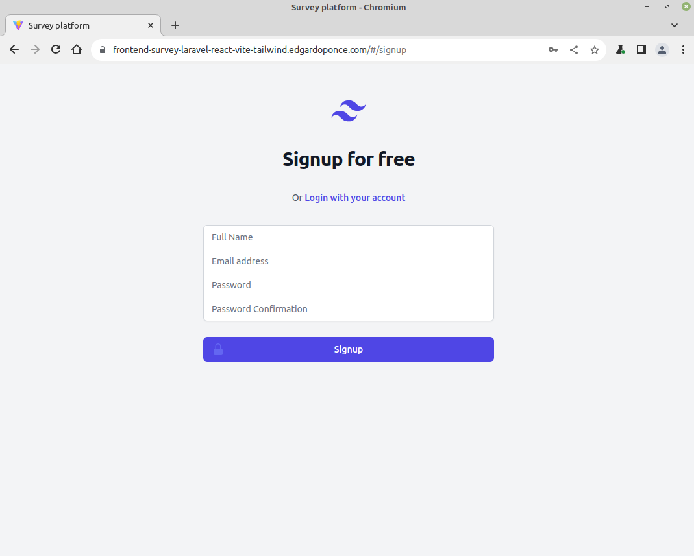
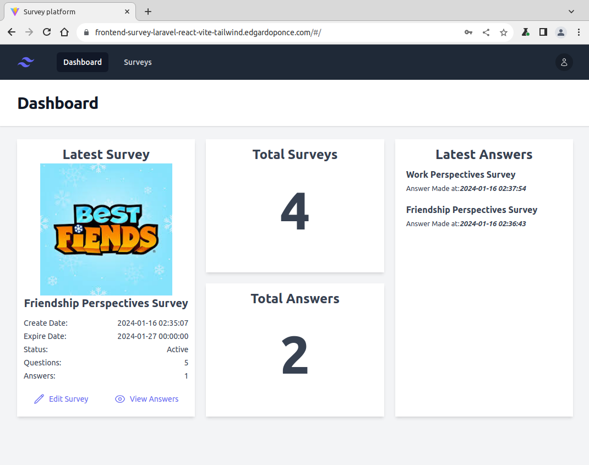
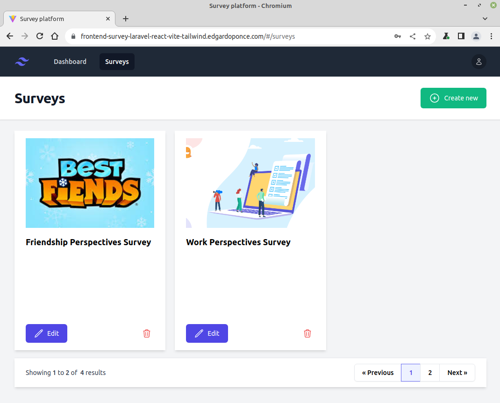
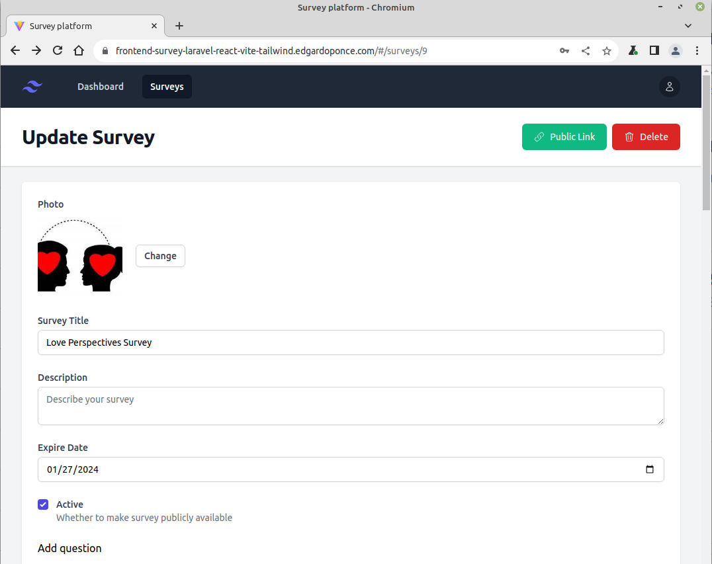
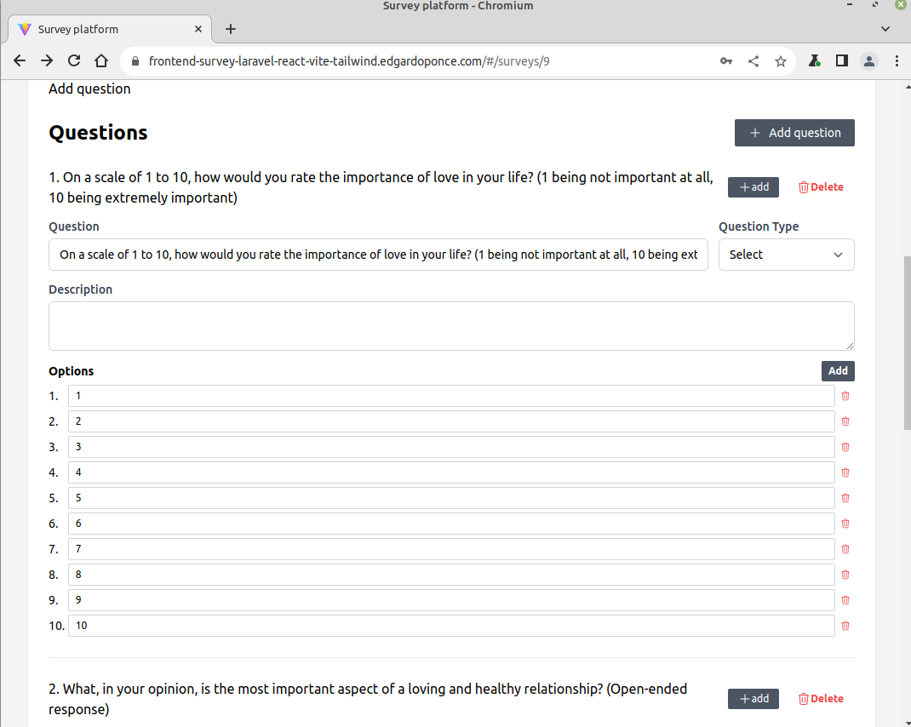
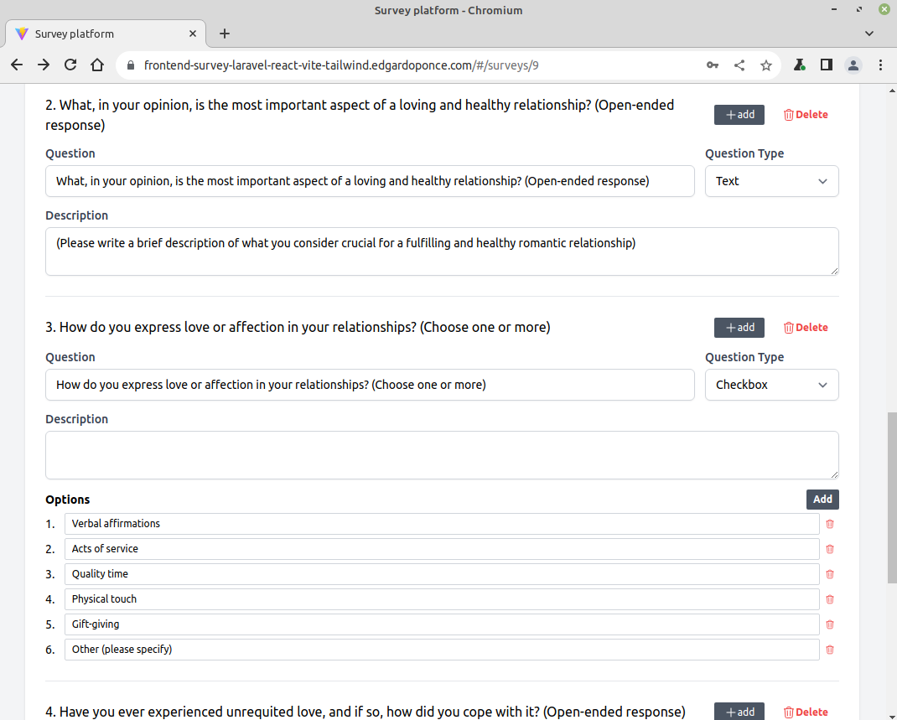
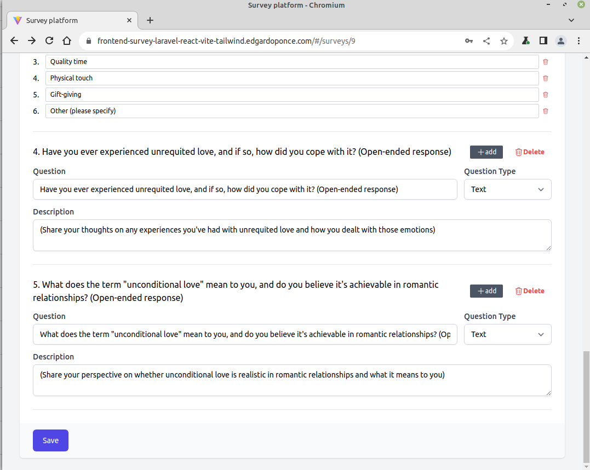
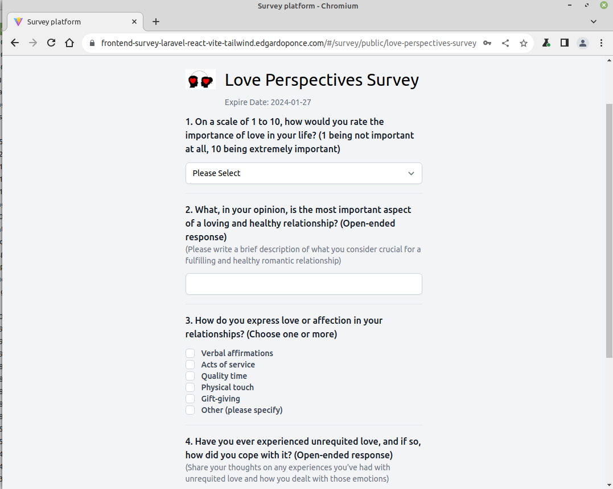
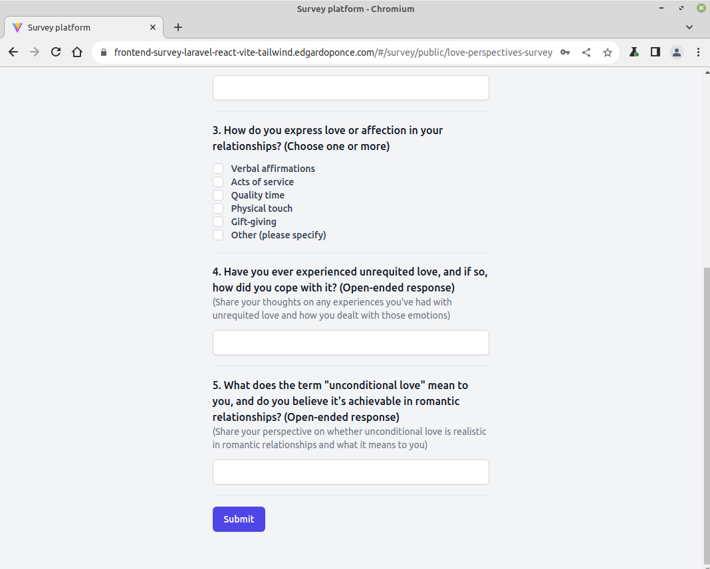

# Survey App with Laravel 9 & React

### 🔑 Auth Screen

<p align="center">
  
</p>

<p align="center">
  
</p>

---

### Dashboard

<p align="center">
  
</p>


---

### Survey

<p align="center">
  
</p>

<p align="center">
  
</p>


<p align="center">
  
</p>

<p align="center">
           
</p>

<p align="center">
           
</p>

<p align="center">
           
</p>

<p align="center">
           
</p>

---


## 🚀 Project Overview
A powerful and flexible survey application built with Laravel 9 (API backend) and React (frontend), featuring:
- User registration & login.
- Dynamic survey creation with customizable fields (select, input, checkbox, etc).
- Ability to add images to surveys.
- Public sharing of surveys without requiring login.
- Dashboard and survey listing for authenticated users.

## 🔗 Live Demo
- [Backend App](https://survey-laravel-react-vite-tailwind.edgardoponce.com/)
- [Frontend App](https://frontend-survey-laravel-react-vite-tailwind.edgardoponce.com/)

## 🛠️ Installation

### Backend (Laravel 9)
```bash
git clone https://github.com/guduchango/survey-laravel-react-vite-tailwind
cd survey-laravel-react-vite-tailwind/backend
composer install
cp .env.example .env
php artisan key:generate
php artisan migrate
php artisan serve
```

### Frontend (React + Vite + Tailwind)
```bash
cd survey-laravel-react-vite-tailwind/frontend
npm install
npm run dev
```

## 🙌 Contributing
I’d love your help! Feel free to open issues, suggest features, or submit pull requests.

## ❤️ Acknowledgements
Big thanks to the open-source community and all the packages that made this project possible.

## 📫 Contact
Learn more about my work on [edgardoponce.com](https://edgardoponce.com)  
Check out the repo: [GitHub](https://github.com/guduchango/survey-laravel-react-vite-tailwind)